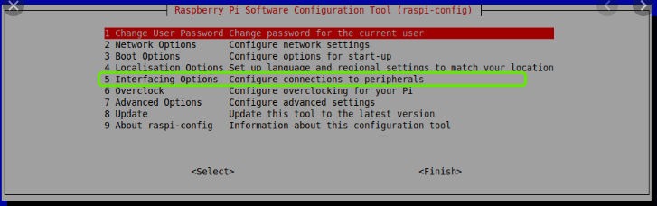
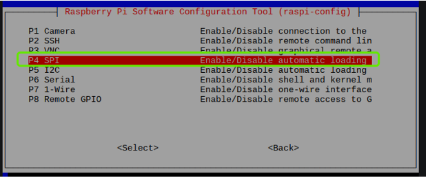
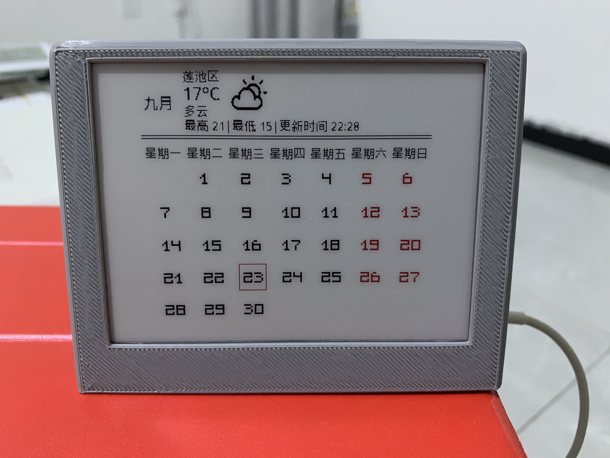

# Ecalender
基于Goodisplay 4.2寸黑白红三色墨水屏(GDEH042Z96)和树莓派zero w，制作的墨水屏日历。

## 目前功能
- 显示当月日历
- 显示当天天气
- 当前日期标识
## 需要优化点/增加功能
- 显示近X天天气
- 无网络提示
## 1.安装库

    sudo apt-get update
    sudo apt-get install python-pip
    sudo apt-get install python-pil
    sudo apt-get install python-numpy
    sudo pip install RPi.GPIO
    
 
## 2.打开树莓派SPI



通过raspi-config ,打开SPI后重启。

## 3.crontab配置

```
# 每隔一个小时 刷新天气
00 *   * * *  python /root/Ecalender/code/eCalender.py
```
## 显示效果
